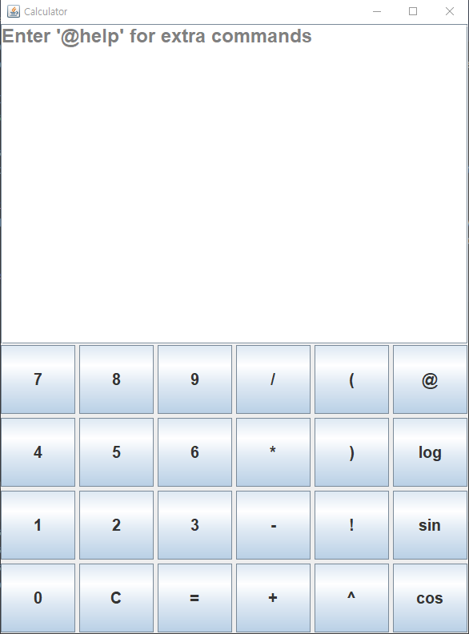
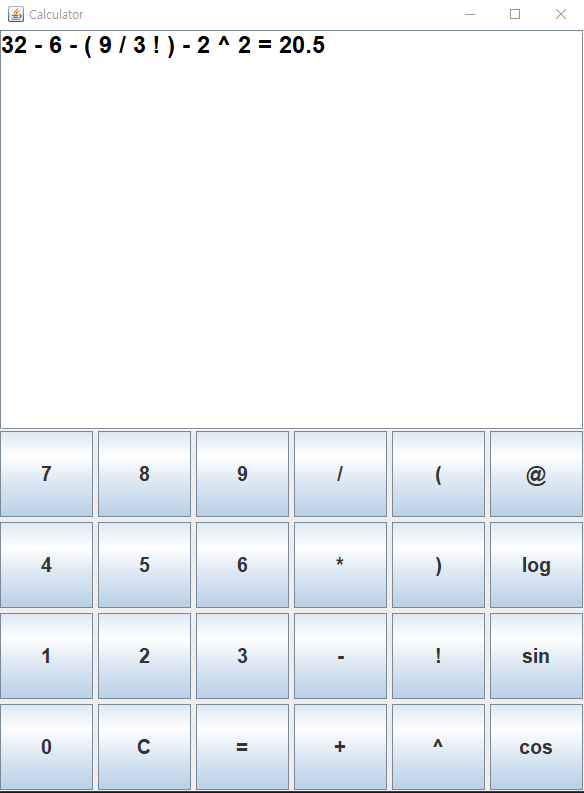
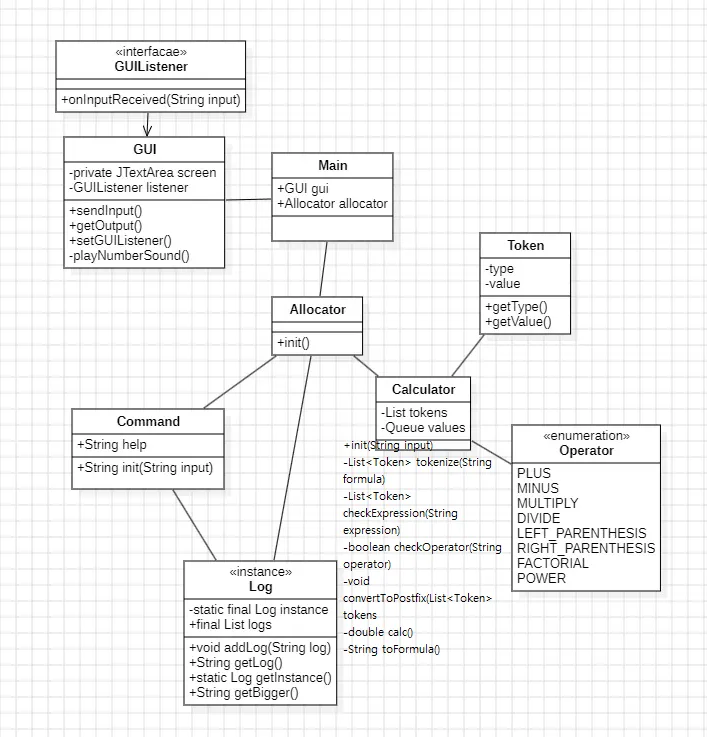

# Java Calculator

---------------------------------------

## Description
This is a simple yet expandable calculator program written in Java. It starts with basic arithmetic operations and progresses through multiple enhancement levels, incorporating features like history tracking, precision calculations, and graphical user interface (GUI) support.

---------------------------------------

## Features
### Level 1 - Basic Calculator
- Accepts two numerical inputs, including zero.
- Performs basic arithmetic operations: `+`, `-`, `*`, `/`.
- Runs continuously until the user types `exit`.
- Provides error handling for invalid inputs.
- Prevents division by zero.
#### Limitations:
- Only basic operations were supported.
- No error handling for invalid input.
- No support for complex expressions or special functions.
---------------------------------------

### Level 2 - Enhanced Functionality
- Introduces a separate `Calculator` class to handle calculations.
- Stores a log of previous calculations.
- Allows users to retrieve calculation history by typing `log`.
#### Limitations:
- Still only basic operations were supported.
---------------------------------------

### Level 3 - Precision and Filtering
- Uses `BigDecimal` to ensure high precision in calculations.
- Implements an `Operator` enum for efficient operation handling.
- Introduces a filter to display only results greater than a specified threshold using the `big` command.

---------------------------------------

### Level 3.5 - Enhanced Expression Parsing and Advanced Operations
- **Postfix Evaluation**: Implements a more advanced expression parsing strategy by converting infix expressions into postfix notation using the Shunting Yard algorithm. Now this program can solve the complicated formulas.
- **Factorial and Exponentiation**: Added support for factorial (`!`) and exponentiation (`^`) operations alongside the basic arithmetic operations (`+`, `-`, `*`, `/`).
- **Handling Parentheses**: Parentheses are now supported in mathematical expressions, which are converted into postfix notation for proper evaluation.
- **Custom Commands**: The program introduces custom commands like `@help`, `@big`,`@log`, and `@exit` to provide more functionality and improve user experience.
- **BigDecimal Precision**: The results are printed with high precision, ensuring no loss of accuracy during calculations.

### New Classes Introduced:
- **`Calculator`**: This class now supports advanced operations and expression parsing. It handles converting infix expressions to postfix and evaluates them using a stack.
- **`ExpressionChecker`**: Responsible for tokenizing user input and checking the validity of the mathematical expression.
- **`InputCommands`**: Manages special commands like `@exit`, `@help`, and `@log`.
- **`Log`**: A singleton class for logging calculation history and filtering results based on a user-defined threshold.
- **`OutputProcessor`**: Handles the display of results and logs them.

### Example Usage:
```text
Enter '@help' for extra commands
@log
1. 5 + 3 = 8
2. 2 ^ 3 = 8
3. 5 ! = 120

Enter '@big' to filter results greater than a specific value
@big 10
3. 5 ! = 120
```

### Commands:
- `@exit`: Exits the program.
- `@help`: Displays a list of available commands.
- `@log`: Displays the history of previous calculations.
- `@big [value]`: Filters and displays calculations greater than the specified value.

---------------------------------------

### Level 4 - GUI Implementation
- In this level, the calculator was enhanced with a graphical user interface (GUI) using Java Swing. The GUI allows users to interact with the calculator in a visually intuitive way. The main features of the GUI include:

#### Key Components:
1. **Main Window**:
    - The calculator is displayed in a window with a text area for showing results and an array of buttons for numbers and operations.
    - A `JTextArea` is used to display the current expression and result.
    - The text area has an interactive feature where the placeholder text "Enter '@help' for extra commands" appears when the user hasn't entered any input.

2. **Buttons**:
    - Buttons for numbers (0-9), operators (+, -, *, /, ^), and special functions (sin, cos, log).
    - Additional buttons for commands such as `@`, `log`, and `C` (to clear the display).
    - Each button triggers an action when clicked, updating the expression in the text area or performing calculations.

3. **Sound Effects**:
    - When the user presses a number button, a corresponding sound is played for a more interactive experience. 

4. **Focus Listener**:
    - If the user focuses on the text area, the default text ("Enter '@help' for extra commands") disappears, and if the area loses focus with no input, the text is reset.

5. **Keyboard Shortcuts**:
    - The program responds to the Enter key for processing the calculation when the user hits "Enter".

6. **Single Instance**:
    - The `CalFrame` class implements a singleton pattern, ensuring only one instance of the calculator frame is active at any time.

7. **Error Handling**:
    - If an invalid expression or command is entered, the program will show appropriate messages and allow for retries.

#### Limitations:
- One of the key advantages of Java, object-oriented programming, has not been effectively utilized in this project. The classes were created recklessly without considering proper organization, and there is a clear lack of adherence to the Single Responsibility Principle, which limits the overall structure and maintainability of the code
- I wanted to make it easier to add new features, but unfortunately, that was not the case. In fact, adding new features feels more complicated and frustrating.

## Example Usage:





---------------------------------------

### Level 5 - Renewal
#### Class Diagram

- I've completely changed the structure in order to fuifill the Single Responsibility Principle.
- I divided the Front End part and Back End part. GUI part is the Front End part. The listener waits user to click “=” button of the screen or the “Enter” key.
- The `Main` class initializes the `GUI` and `Allocator`.
- The `GUIListener` interface is implemented in the `Main` class, which listens for input from the GUI. When input is received, it invokes the `Allocator` to perform the calculation.
- The GUI and back-end logic are separated, which improves maintainability and allows for better code organization.
- The `GUIListener` interface acts as a communication bridge between the front-end (GUI) and the back-end logic (Allocator).

##### How it works?
1. On `Main` class, the program waits for a string input via the `GUIListener`.
2. When the user inputs  a value in the `GUI` screen (either by clicking `=` button or pressing the `Enter` key), the value is passed to the `Allocator` class.
3. The `Allocator` then checks if the input starts with `@` to determine if it's a command or an expression.
4. If the input starts with, `@` it is passed to the `Command` class, which handles specific commands.
5. If the input doesn't start with `@`, the `Allocator` passes it to the `Calculator` class. 
6. The `Calculator` then tokenizes the input, converts it into Revers Polish Notation(RPN), and uses a stack to evaluate the expression and return the result.
7. Once the result is calculated or a command is executed, the `Allocator` stores the result in the singleton `Log` class' log. The result or log is then sent back to the `Main` class.
8. The `Main` class then passes this result back to the `GUIListener` which updates the `screen in the GUI to display the result or output.
---------------------------------------
## Final Thoughts
Thanks for checking out this project! I learned the importance of making class diagram and checking logs on this project. Also, I should write comments from next time on.
